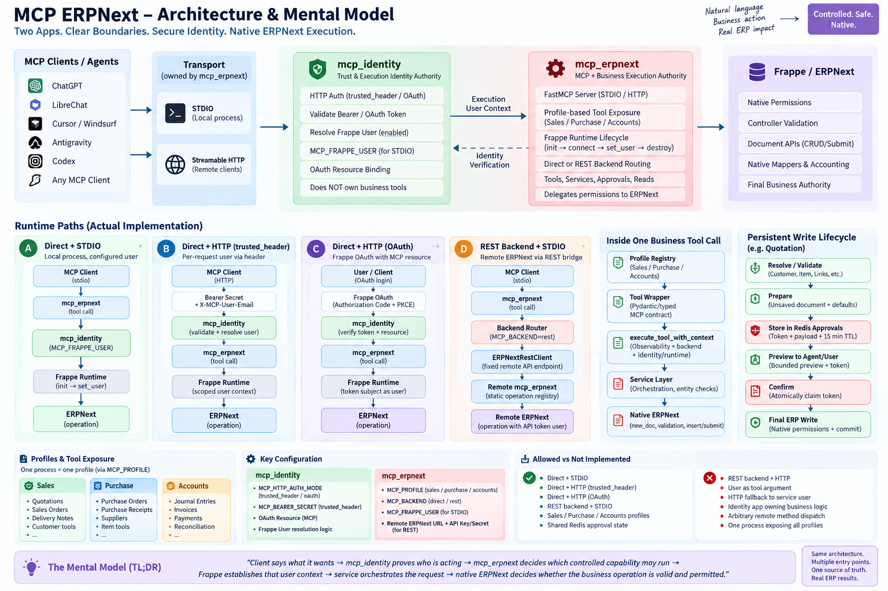

# MCP Identity

## Architecture & Mental Model



`mcp_identity` owns MCP authentication-mode configuration, resolves verified
Frappe execution identities for MCP consumers, and supplies the narrow Frappe
OAuth resource-binding compatibility layer described below. It owns no custom
DocTypes, business permissions, generic provider adapters, Frappe runtime
lifecycle, or MCP tool permissions.

## Identity configuration

```dotenv
# HTTP only. Absence defaults to trusted_header for backward compatibility.
MCP_HTTP_AUTH_MODE=trusted_header

# Required only for trusted_header HTTP mode; minimum 32 characters.
MCP_HTTP_SHARED_SECRET=<minimum-32-character-secret>

# Configured stdio Frappe execution identity.
MCP_FRAPPE_USER=user@example.com
```

Auth-mode values are exact and case-sensitive; surrounding whitespace is not
accepted. OAuth is implemented for a Streamable HTTP consumer that wires this
app's `FrappeOAuthTokenVerifier` into FastMCP. It validates an opaque native
Frappe OAuth token on every request and never falls back to trusted-header or
stdio identity.

## HTTP identity contract

The supported client sends both values with each request:

```http
Authorization: Bearer <MCP_HTTP_SHARED_SECRET>
X-MCP-User-Email: person@example.com
```

`MCP_HTTP_SHARED_SECRET` is server-only configuration and must be at least 32
characters. The secret authenticates the configured client; only after it
validates does the app resolve the supplied email to an existing, enabled
Frappe `User`. Missing, malformed, unknown, disabled, or unauthenticated
identities fail closed. No Guest, service-user, previous-request, or provider
mapping fallback is used for HTTP requests.

Consumers receive the resolved Frappe User and run their own request-scoped
context, call `frappe.set_user()`, and enforce native permission checks. For
stdio, the consumer first opens a usable Frappe site context, then asks this app
to validate `MCP_FRAPPE_USER`. The dependency direction is:

```text
Frappe -> mcp_identity -> mcp_erpnext / future MCP consumers
```

This app is not an ERPNext permission system and is not an adapter for any
specific MCP client or identity provider. All variables live in the consuming
process environment; the ownership above does not imply a separate `.env`
loader or namespace.

## Frappe OAuth resource binding

For a Frappe site acting as the OAuth Authorization Server, `mcp_identity` must
be installed on that site. Source code merely being present in the Bench is not
sufficient. Installation creates or updates only the optional
`custom_mcp_resource` Custom Field on the native `OAuth Client`, `OAuth
Authorization Code`, and `OAuth Bearer Token` records. The historical patch is
retained for upgrades, but fresh installation does not depend on migration
patch execution. This setup does not create a token store or backfill existing
OAuth records.

Configure a pre-registered native Frappe OAuth Client for authorization-code
and `code` response flows, then set its MCP Resource field to the canonical
public MCP URL, including the MCP path, for example:

```text
https://mcp.example.com/mcp
```

Blank clients keep native Frappe OAuth behavior. Bound clients require exactly
one matching RFC 8707 `resource`, S256 PKCE, and the same binding through code
exchange and refresh. Code consumption and refresh rotation use native row
locks and the bearer-token insertion transaction. DCR/CIMD binding is not
supported, and existing records are intentionally left unbound.

For resource-server startup, `MCP_OAUTH_FRAPPE_CLIENT_ID` may identify that
OAuth Client by record name or `client_id`. The client resource must exactly
match the canonical `MCP_OAUTH_RESOURCE_SERVER_URL`; OAuth mode also requires a
canonical root-only `MCP_OAUTH_ISSUER_URL`, `MCP_FRAPPE_SITE`, and at least one
space- or comma-separated `MCP_OAUTH_REQUIRED_SCOPES` value. The verifier
requires an Active, non-expired bearer token; matching client/resource; every
configured scope; and an enabled non-Guest token user.

For OAuth Streamable HTTP, configure the resource server explicitly:

```dotenv
MCP_TRANSPORT=streamable-http
MCP_HTTP_AUTH_MODE=oauth
MCP_OAUTH_ISSUER_URL=https://erp.example.com
MCP_OAUTH_RESOURCE_SERVER_URL=https://mcp.example.com/mcp
MCP_OAUTH_REQUIRED_SCOPES=mcp:access
MCP_OAUTH_FRAPPE_CLIENT_ID=<pre-registered-client-id>
```

The MCP SDK supplies bearer authentication, protected-resource metadata, and
401/403 handling. The token's native Frappe User is the only HTTP execution
identity; `X-MCP-User-Email`, `MCP_FRAPPE_USER`, and
`MCP_HTTP_SHARED_SECRET` have no authority in OAuth mode. Public HTTPS and
external ChatGPT verification remain deployment-specific follow-up work; they
are not established merely by the local source integration.
